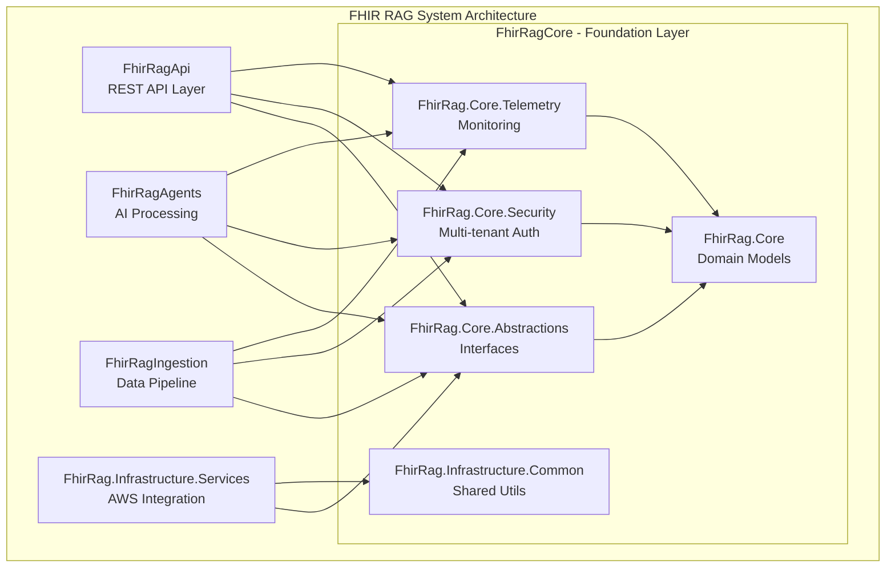

# FhirRag Core Libraries

## 🎯 Solution Overview

The **FhirRagCore** solution contains the foundational libraries for the FHIR RAG (Retrieval-Augmented Generation) system. This solution provides the core domain models, abstractions, security framework, telemetry infrastructure, and common utilities that underpin the entire FHIR RAG architecture.

## 🏗️ Architecture Role



## 📦 Projects

### FhirRag.Core
**Core FHIR domain models and business logic**

- **Purpose**: Central domain models for FHIR R4 resources
- **Key Classes**: `FhirPatient`, `FhirCondition`, `FhirObservation`, `ProcessingResult`
- **Features**: 
  - Clinical validation helpers
  - Extension methods for FHIR resources
  - Multi-tenant data models
  - Clinical relationship mapping

### FhirRag.Core.Abstractions
**Interface definitions and base classes**

- **Purpose**: Contract definitions for dependency injection and testing
- **Key Interfaces**: `IFhirProcessor<T>`, `IStorageService`, `ITelemetryService`, `ISecurityContext`
- **Features**:
  - Service abstractions for all major components
  - Pipeline abstractions with retry policies
  - Repository patterns for data access
  - Clinical NLP and terminology interfaces

### FhirRag.Core.Security
**Multi-tenant security and authentication framework**

- **Purpose**: Comprehensive security layer for healthcare data
- **Key Classes**: `SecurityContext`, `JwtTokenService`, `AccessControlService`
- **Features**:
  - JWT token validation and generation
  - Role-based access control (RBAC)
  - Multi-tenant isolation enforcement
  - Audit logging capabilities
  - HIPAA compliance features

### FhirRag.Core.Telemetry
**Comprehensive monitoring and analytics system**

- **Purpose**: Track system performance and generate training data
- **Key Classes**: `TelemetryContextProvider`, `DynamoDbTelemetryService`, `TelemetryModels`
- **Features**:
  - Processing step tracking
  - Performance metrics collection
  - User feedback aggregation
  - Multi-tenant telemetry isolation
  - DynamoDB and S3 integration

### FhirRag.Infrastructure.Common
**Shared infrastructure utilities**

- **Purpose**: Common patterns and utilities across all solutions
- **Features**:
  - Configuration helpers
  - Common exception types
  - Utility extensions
  - Shared constants and enums

## 🔗 Key Interfaces Exposed

```csharp
// Core processing interface
public interface IFhirProcessor<TResource>
{
    Task<ProcessingResult> ProcessAsync(TResource resource, string tenantId, CancellationToken cancellationToken = default);
    Task<bool> ValidateAsync(TResource resource, CancellationToken cancellationToken = default);
}

// Storage abstraction
public interface IStorageService
{
    Task<T> GetAsync<T>(string key, string tenantId, CancellationToken cancellationToken = default);
    Task SaveAsync<T>(string key, T data, string tenantId, CancellationToken cancellationToken = default);
}

// Security context
public interface ISecurityContext
{
    string UserId { get; }
    string TenantId { get; }
    IReadOnlyList<string> Permissions { get; }
    bool HasPermission(string permission);
}

// Telemetry tracking
public interface ITelemetryService
{
    ITelemetryContext CreateContext(string entityType, string entityId);
    Task SaveTelemetryAsync(TelemetryData data, CancellationToken cancellationToken = default);
}
```

## 🔄 Dependencies

### Internal Dependencies
- **No internal dependencies** - This is the foundation layer

### External Dependencies
- **HL7 FHIR .NET SDK**: FHIR R4 resource definitions
- **AWS SDK**: For DynamoDB and S3 integration in telemetry
- **System.IdentityModel.Tokens.Jwt**: JWT token handling
- **Microsoft.Extensions.DependencyInjection**: DI container support
- **System.ComponentModel.DataAnnotations**: Model validation

## 🚀 Build Instructions

### Prerequisites
- .NET 9.0 SDK
- AWS CLI configured (for telemetry services)

### Build Commands
```bash
# Navigate to solution directory
cd solutions/FhirRagCore

# Restore dependencies
dotnet restore

# Build solution
dotnet build --configuration Release

# Run tests
dotnet test --configuration Release

# Create NuGet packages
dotnet pack --configuration Release --output ../../packages
```

### Package Publishing
```bash
# Pack all projects
dotnet pack --configuration Release --include-symbols --include-source

# Push to NuGet (requires API key)
dotnet nuget push "bin/Release/*.nupkg" --source https://api.nuget.org/v3/index.json
```

## ⚙️ Configuration

### Required Configuration (appsettings.json)
```json
{
  "FhirRag": {
    "Security": {
      "JwtSettings": {
        "SecretKey": "your-secret-key",
        "Issuer": "fhir-rag-system",
        "Audience": "fhir-rag-clients",
        "ExpirationMinutes": 60
      },
      "MultiTenant": {
        "TenantIdHeader": "X-Tenant-Id",
        "EnableTenantValidation": true
      }
    },
    "Telemetry": {
      "DynamoDb": {
        "TableName": "fhir-rag-telemetry",
        "Region": "us-east-1"
      },
      "S3": {
        "BucketName": "fhir-rag-telemetry-data",
        "Region": "us-east-1"
      }
    }
  }
}
```

### Environment Variables
```bash
# AWS Configuration
AWS_ACCESS_KEY_ID=your_access_key
AWS_SECRET_ACCESS_KEY=your_secret_key
AWS_DEFAULT_REGION=us-east-1

# Security
FHIR_RAG_JWT_SECRET=your-jwt-secret-key
FHIR_RAG_ENCRYPTION_KEY=your-encryption-key

# Telemetry
FHIR_RAG_TELEMETRY_TABLE=fhir-rag-telemetry
FHIR_RAG_TELEMETRY_BUCKET=fhir-rag-telemetry-data
```

## 🧪 Testing Strategy

### Unit Tests
- **FhirRag.Core.Tests**: Domain model validation and business logic
- **FhirRag.Core.Security.Tests**: Authentication and authorization flows
- **FhirRag.Core.Telemetry.Tests**: Telemetry collection and processing

### Test Categories
```bash
# Run all unit tests
dotnet test --configuration Release

# Run security tests only
dotnet test --configuration Release --filter Category=Security

# Run with coverage
dotnet test --collect:"XPlat Code Coverage" --results-directory ./TestResults/
```

### Test Coverage Requirements
- **Minimum Coverage**: 85%
- **Critical Components**: 95% (Security, Core models)
- **Integration Points**: 90% (Telemetry, Storage abstractions)

## 🔒 Security Features

### Multi-Tenant Isolation
- All data models include `TenantId` for strict isolation
- Security context validation on all operations
- Tenant-specific encryption and access controls

### Authentication & Authorization
- JWT token-based authentication
- Role-based access control (RBAC)
- Fine-grained permission system
- Multi-factor authentication support

### Data Protection
- Encryption at rest and in transit
- PII/PHI data masking capabilities
- Comprehensive audit logging
- GDPR/HIPAA compliance features

## 📊 Telemetry & Monitoring

### Metrics Collected
- Processing step performance
- Resource utilization
- Error rates and patterns
- User interaction patterns

### Storage Architecture
- **DynamoDB**: Fast query performance for telemetry data
- **S3**: Long-term storage for detailed processing logs
- **Partitioning**: Tenant-based data isolation

## 🔧 Usage Examples

### Basic Domain Model Usage
```csharp
// Create a FHIR patient with multi-tenant support
var patient = new FhirPatient
{
    Id = "patient-123",
    Identifier = "MRN-12345",
    GivenName = "John",
    FamilyName = "Doe",
    Gender = "male",
    BirthDate = new DateTime(1980, 5, 15),
    TenantId = "hospital-a"
};

// Add clinical relationships
patient.AddCondition("diabetes-type-2");
patient.AddObservation("blood-glucose-reading");

// Validate and calculate derived data
var age = patient.GetAge();
var isValid = patient.Validate();
```

### Security Context Usage
```csharp
// Create security context
var securityContext = new SecurityContext
{
    UserId = "user-123",
    TenantId = "hospital-a",
    Permissions = { "read.patient", "write.observation" }
};

// Check permissions before operations
if (securityContext.HasPermission("read.patient"))
{
    // Safe to read patient data
    var patient = await patientService.GetAsync(patientId, securityContext.TenantId);
}
```

### Telemetry Tracking
```csharp
// Start telemetry tracking
var telemetryContext = telemetryProvider.CreateContext("Patient", "patient-123");
var step = telemetryContext.StartStep("fhir_validation");

try
{
    // Perform processing
    var result = await ProcessPatientAsync(patient);
    
    step.AddData("validation_time_ms", stopwatch.ElapsedMilliseconds);
    step.AddData("resource_count", result.ProcessedResources);
    step.Complete(true);
}
catch (Exception ex)
{
    step.Complete(false, ex.Message);
    throw;
}
```

## 🗺️ Integration Points

### Consumed by Solutions
- **FhirRagApi**: Uses core models and security for REST API
- **FhirRagIngestion**: Uses abstractions and telemetry for data pipeline
- **FhirRagAgents**: Uses core models and interfaces for AI processing
- **FhirRag**: Uses infrastructure services and security

### External Integrations
- **AWS DynamoDB**: Telemetry data storage
- **AWS S3**: Large object and backup storage
- **HL7 FHIR Specification**: Compliant with FHIR R4 standard
- **Identity Providers**: JWT token validation

## 📈 Performance Characteristics

- **Memory Usage**: < 100MB for core libraries
- **Startup Time**: < 2 seconds for DI container registration
- **Throughput**: > 1000 operations/second for core validations
- **Latency**: < 50ms for security context operations

## 🚨 Troubleshooting

### Common Issues

1. **JWT Token Validation Failures**
   ```bash
   # Check token configuration
   dotnet user-secrets list --project FhirRag.Core.Security
   ```

2. **DynamoDB Connection Issues**
   ```bash
   # Verify AWS credentials
   aws sts get-caller-identity
   ```

3. **Tenant Validation Errors**
   ```bash
   # Check tenant configuration in logs
   grep "TenantValidation" logs/application.log
   ```

---

**🏥 Built for Healthcare Excellence - Secure, Scalable, Compliant**